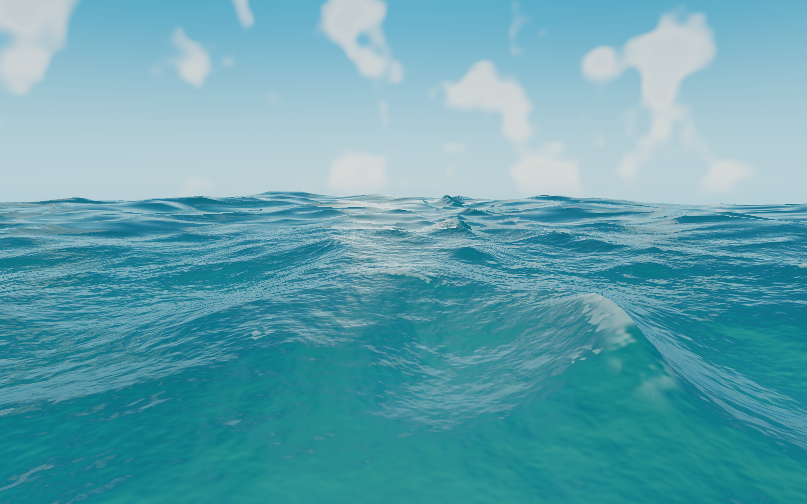

# inkwell-webgpu-water

A standalone raw-WebGPU study of Inkwell 3D's Tethys water. The default lab renders the water surface and submerged sand; an island-shore stress scene exercises wet/dry boundaries and refraction. There is no grass, motes, spray, splash-particle pass, Three.js, React Three Fiber, or React-owned game-world simulation.

## Library package

The npm package exposes the browser-only WebGPU engine without the Next.js
demo, React UI, screenshots, benchmarks, or 26 MB demonstration ship asset.

```bash
npm install @yong_three/three-water
```

```ts
import { WebGpuWaterEngine } from "@yong_three/three-water";

const canvas = document.querySelector<HTMLCanvasElement>("canvas");
if (!canvas) throw new Error("Missing ocean canvas");

const ocean = new WebGpuWaterEngine(canvas, {
  scene: "open",
  waveScale: 1,
});

await ocean.init();

// Call this when the canvas or owning component is removed.
ocean.dispose();
```

For an existing Three.js WebGPU scene, use the compatibility entry point. It
reuses the host renderer, device, canvas, scene, and render loop; it does not
create any of them:

```bash
npm install three @yong_three/three-water
```

```ts
import { createThreeGlobeWater, createBuoyancySampler } from
  "@yong_three/three-water/three";

const ocean = createThreeGlobeWater({
  renderer,
  radius: GLOBE_RADIUS,
  heightField,
  projection: {
    worldSize: WORLD_SIZE,
    metersPerRadianLon: M_PER_RAD_LON,
    metersPerRadianLat: M_PER_RAD_LAT,
  },
  environment: skyEnv.environment,
});

await ocean.init();
scene.add(ocean.mesh);
const buoyancy = createBuoyancySampler(ocean.waves);

// The host application owns the frame loop and calls these each frame.
ocean.waves.update(renderer, elapsed);
ocean.update(elapsed, camera);
buoyancy.update(renderer, shipInput);
```

The Three.js adapter declares `three` as a peer dependency (`>=0.184.0 <0.185.0`).
Textures supplied through `heightField`, `setPatch`, or `environment` remain
owned by the calling application and are not disposed by `ocean.dispose()`.

All constructor options are optional and merge with
`DEFAULT_WATER_LAB_OPTIONS`. Pass `shipModelUrl` when your application hosts a
compatible glTF model; the library default is `null`, so the core renderer has
no asset-path assumptions. The engine requires a WebGPU-capable browser and
must be created on the client in frameworks that render on the server.

Maintainers can validate the complete application and inspect the exact npm
tarball before publishing:

```bash
npm run release:check
npm publish
```



**在线 Demo：** [https://water.ceo-online.app/](https://water.ceo-online.app/)

## Run it

```bash
npm install
npm run dev
```

Open `http://localhost:3000`. Drag to orbit and use the wheel to zoom. The panel can switch surface/underwater cameras, open-ocean/island scenes, and optimized/reference paths. Add `?ui=0&fixedTime=8.25` for a repeatable clean frame, or `?scene=shore` for the island validation scene.

## Renderer

- A 513² compute-generated submerged-sand height/normal field.
- A bufferless terrain grid plus four camera-snapped, nested water rings reconstructed from `vertex_index`/`instance_index`.
- Three independent 128² TMA/JONSWAP spectral cascades for long swell, wind waves, and capillary-gravity detail.
- Per-frame frequency-domain evolution and fourteen-stage Stockham inverse FFTs, with four complex displacement/derivative fields transformed in parallel per cascade.
- A second directional JONSWAP component in the long and medium bands for natural cross-swell instead of a single repeating wave direction.
- A low-order bound-harmonic correction sharpens crests and broadens troughs instead of leaving the FFT surface vertically symmetric.
- Long/medium displacement drives the mesh; a 12 m capillary-gravity cascade reaches decimetre wavelengths and transitions into the surface BRDF with distance instead of becoming a streaky normal texture.
- A 256² conservative nearshore state stores surface elevation, two momentum components, and persistent foam. It uses hydrostatic wet/dry reconstruction, Rusanov fluxes, bounded depth/momentum, Manning friction, and far-field spectral boundary forcing.
- Breaker activation persists in a ping-pong event field with separate spectral-compression and shallow-water/Froude criteria. The open-ocean study retains a narrow 256×48 attached crest patch only where that event field is active.
- Foam is backtraced through the nearshore velocity, diffused slightly, born from Jacobian compression, hydraulic breaking, and shore motion, then decays. Multi-scale breakup changes coverage after the physical selection.
- Exposed shore terrain uses domain-warped dune relief and multi-scale procedural sediment colour. The active nearshore elevation/foam state also drives the narrow wet-sand and backwash transition, so the waterline is not a static painted band.
- The normal scene reports 166,400 terrain + water + local-breaker triangles, down from the previous 230,400 grid total. The island stress scene deliberately uses matching 512² terrain/water contours (1,048,576 triangles) to reject shoreline popping.
- Beer-Lambert-style RGB absorption, low-energy volume scattering, exact dielectric Fresnel reflection, a wind-anisotropic Cox-Munk sun-glitter BRDF, and underwater fog.
- A high-key cerulean/turquoise art direction keeps the physically separated reflection and transmission readable while matching Inkwell's brighter, Breath-of-the-Wild-like world palette.
- Whitecaps and restrained seabed light focusing are selected from simulated displacement Jacobians; there are no painted cellular overlays or detached breaker sheets.
- The seabed and water are procedural. The renderer loads no image texture assets.
- The open ocean uses no scene capture. The island scene captures atmosphere/terrain color and depth once, then uses real thickness-aware refraction; it does not render separate reflection and refraction copies of the world.
- The shoreline uses the same displaced water and terrain fields in the vertex and fragment stages, derivative-width alpha coverage, and a wet-sand optical transition rather than a hard discard edge.
- React owns the controls and telemetry only; the render loop and GPU resources live in the imperative WebGPU engine.

## Measured result

The saved Apple/Metal benchmark held 60 fps in every case with no frames over 50 ms and no console or page errors. After adding the nonlinear nearshore state, persistent breakers/foam, scene integration hook, clipmap water mesh, and state-driven shore material, the latest retained run measured **6.883 ms GPU total at the surface** and **6.150 ms underwater**. Against this repository's deliberately heavier matched reference path, that is a **9.15% surface** and **9.30% underwater** reduction. The intentionally dense island case (1,048,576 terrain + water triangles, 512² simulation, 1.25× render scale) measured **9.315 ms GPU total**, improved from its 9.540 ms pre-pass baseline. The renderer remains inside the 16.67 ms frame budget; these figures are intentionally reported as a quality/architecture result rather than a dramatic speedup claim.

These are controlled A/B results inside this isolated renderer, not a claim about full-game speed. The complete raw report is in [`benchmarks/webgpu-water-latest.json`](benchmarks/webgpu-water-latest.json).

```bash
npm run check
npm run benchmark
npm run visual:gate
npm run screenshots
```

Screenshot capture uses fixed time and a 1600×1000 clean viewport. It preserves the main surface and underwater frames plus a breaker profile and both sides of the periodic reset. The pre-spectral surface/underwater frames and benchmark are preserved under `benchmarks/visual/baseline-20260811-141446/` for direct review.

## Research

The design choices and sources are documented in [`docs/research.md`](docs/research.md). The short version is: separate wavelengths into simulation cascades, transition unresolved slopes into the BRDF, derive foam from deformation, and reject any procedural pattern that looks pasted onto the water during a full-width screenshot review.

## Acknowledgements

This project builds on [original work by **James
Addison**](https://github.com/siliconjungle/inkwell-webgpu-water). Many thanks
to James for creating and sharing the foundation that made this WebGPU water
study possible. The subsequent modifications, standalone npm packaging, and
ongoing maintenance are by **Yong Li**.

This is an independently maintained fork and npm distribution. It is not an
official release by James Addison, nor does it imply his endorsement.

## License

MIT. The original copyright and permission notice are retained in
[`LICENSE`](LICENSE). Demo asset provenance and other acknowledgements are in
[`THIRD_PARTY_NOTICES.md`](THIRD_PARTY_NOTICES.md).
